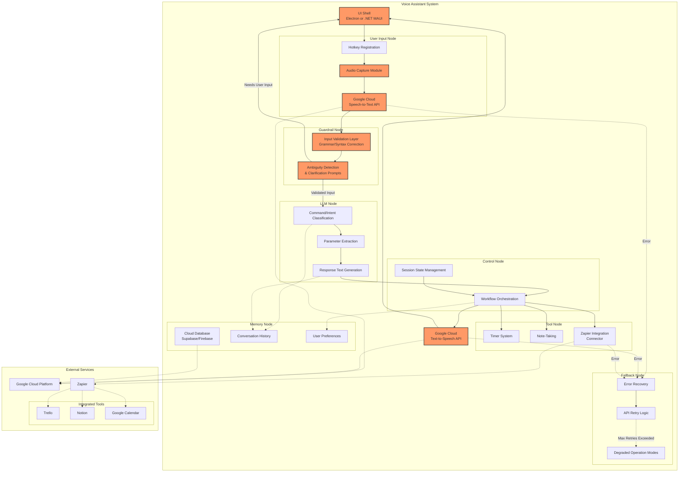

# Voice Assistant MVP Architecture

## Seven-Node Architecture with Voice Workflow Focus

## Voice Workflow MVP Component Details

### 1. Hotkey Registration System
- Registers system-wide keyboard shortcuts
- Uses OS-specific APIs via chosen desktop framework
- Activates voice input mode when triggered

### 2. Audio Capture Module
- Interfaces with microphone hardware
- Handles recording start/stop
- Processes audio streams for STT service

### 3. Speech-to-Text API Integration
- Uses Google Cloud Speech-to-Text API (free tier)
- Converts audio to text representation
- Handles streaming recognition for real-time feedback

### 4. Input Validation Layer
- Detects and corrects grammatical/syntactical errors
- Analyzes logical consistency of commands
- Implements the Guardrail node functionality

### 5. Clarification Protocol
- Detects ambiguous or uncertain commands
- Generates targeted clarification questions
- Confirms interpretations with user

### 6. Command Interpreter
- Identifies intent from validated text
- Extracts parameters and arguments
- Maps to executable actions

### 7. Response Generator
- Creates natural language responses
- Formats command feedback appropriately
- Prepares text for TTS conversion

### 8. Text-to-Speech Integration
- Uses Google Cloud Text-to-Speech API (free tier)
- Converts response text to spoken audio
- Manages voice characteristics and speech settings

### 9. UI Shell
- Provides visual feedback during interactions
- Displays recognized text and agent responses
- Offers fallback text input option

### 10. Cloud Database Integration
- Stores conversation history
- Maintains user preferences
- Leverages Supabase or Firebase based on final decision

## Framework Decision

Based on the requirement for rapid MVP development on Windows while focusing on voice interaction capabilities, **Electron** is recommended for the initial implementation:

- **Pros for this project**:
  - Faster development cycle with web technologies
  - Extensive libraries for audio handling and UI feedback
  - Simpler integration with cloud services via JavaScript SDKs
  - Better suited for quick MVP iteration

- **Alternative**:
  - **.NET MAUI** would provide better native Windows integration but at the cost of longer development time
  - Could be considered for v2 once the voice workflow is validated

## Next Steps

1. Set up Electron project structure
2. Implement hotkey registration
3. Create audio capture module
4. Configure Google Cloud Speech-to-Text API
5. Build initial UI shell for testing 